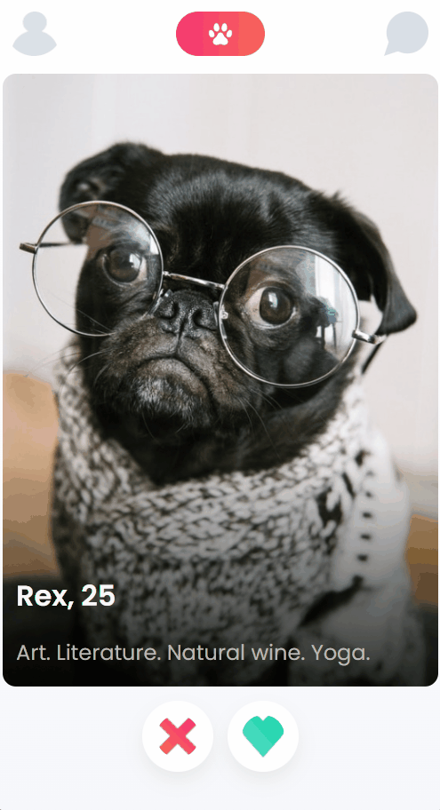

# TinDog - Tinder but for Dogs

This is a simple dog matching app that allows users to swipe through profiles of dogs and indicate their interest in them

**Link to project**:

## About Project

Project was made following a figma design and to learn on building mobile-first and responsive design using Flexbox.

**Tech used:** HTML, CSS, JS

## Lessons Learnt

- Object Destructuring
- Constructor functions, Object.assign and `this`
- Working with Classes
